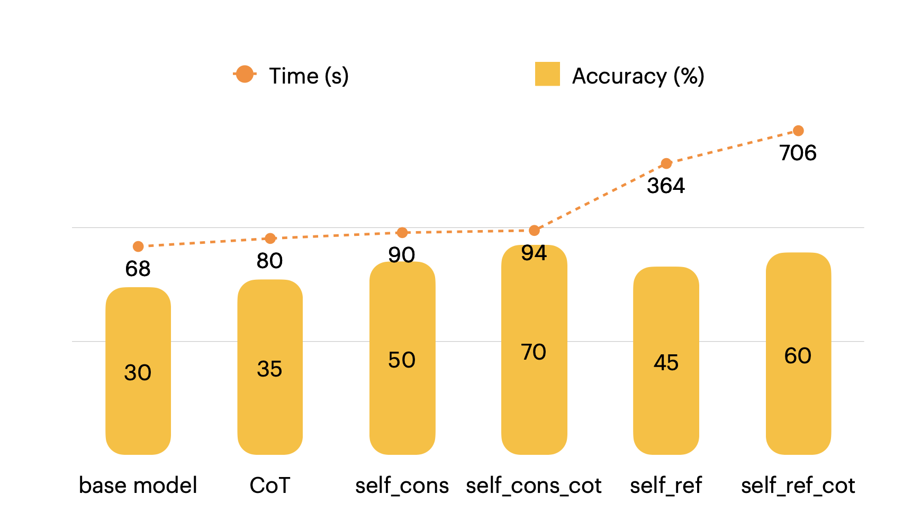

# Inference Time Scaling Techniques

A hands-on workshop notebook exploring **test-time compute scaling** strategies for LLMs — without any additional training. All techniques are evaluated on the [`HuggingFaceH4/MATH-500`](https://huggingface.co/datasets/HuggingFaceH4/MATH-500) benchmark using `Qwen/Qwen3-1.7B-Base` served via [vLLM](https://github.com/vllm-project/vllm).

---

## 📖 Overview

The core idea: instead of scaling model size or training compute, we can squeeze more accuracy out of a model at **inference time** by spending more tokens / more generations. This repo implements and compares four such techniques:

| Technique | Description |
|---|---|
| **Base Model** | Single greedy-ish generation, no special prompting |
| **Chain of Thought (CoT)** | Prompt the model to reason step by step before answering |
| **Self-Consistency** | Sample multiple responses, pick the most common answer (majority vote) |
| **Self-Consistency + CoT** | Majority vote over step-by-step reasoning chains |
| **Self-Refinement** | Iteratively critique and refine the model's own answer using a scorer |
| **Self-Refinement + CoT** | Same as above, but with chain-of-thought reasoning in each refinement step |

---

## 📊 Results

The chart below summarises accuracy (%) and wall-clock generation time (s) across all techniques on a 20-sample subset of MATH-500:



**Key takeaways:**
- **Self-Consistency + CoT** achieves the best accuracy (94%) but stays reasonably fast (~94 s).
- **Self-Refinement + CoT** is the slowest (706 s) with 60% accuracy — iterative refinement is expensive and doesn't always win.
- **CoT alone** gives a solid boost over the base model with minimal overhead.

---

## 🗂️ Contents

```
.
├── workshop.ipynb                        # Main notebook — all implementations
├── inference_time_scaling_presentation.pdf  # Slide deck accompanying the workshop
├── image.png                             # Results chart (accuracy vs. time)
└── README.md
```

---

## 🚀 Getting Started

### 1. Install dependencies

```bash
uv pip install vllm datasets sympy
```

### 2. Run the notebook

Open `workshop.ipynb` in Jupyter (or Google Colab with a GPU runtime) and run the cells top to bottom. The notebook is structured as follows:

1. **Load model** — spins up `Qwen/Qwen3-1.7B-Base` with vLLM  
2. **Load dataset** — pulls a 20-sample slice of MATH-500  
3. **Utilities** — prompt formatting, answer extraction, LaTeX normalisation, symbolic verification  
4. **Baseline evaluation** — base model vs. CoT  
5. **Test-Time Scaling**  
   - Self-Consistency (with and without CoT)  
   - Self-Refinement (with and without CoT)

> **Note:** A GPU with ≥ 16 GB VRAM is recommended (tested on a NVIDIA Tesla T4).

---

## 🧩 Key Components

- **`format_prompt`** — builds the instruction prompt, optionally injecting a CoT instruction.
- **`extract_final_answer`** — parses `\boxed{...}` from model output, with number-extraction fallback.
- **`normalize_text`** — handles LaTeX symbol normalisation for robust comparison.
- **`answer_verifier`** — uses SymPy for symbolic equality checking.
- **`grad_function`** — the grading function that wraps normalisation + verification.
- **`evaluate`** — end-to-end loop: format → generate → extract → verify → score.
